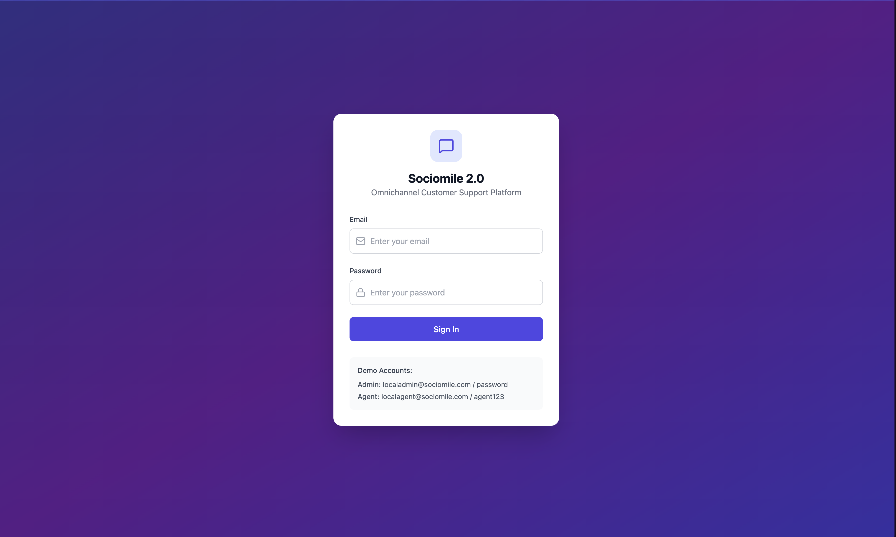

SOCIOMILE 2.0
=============

Ringkasan
---------
SOCIOMILE 2.0 adalah aplikasi percakapan/CRM real-time dengan arsitektur monorepo yang terdiri dari layanan backend (Go) dan frontend (React/TypeScript). Repo ini mengandung kode server, API, client web, migrasi database, dan konfigurasi Docker.

Repository layout
-----------------
- `backend/`: layanan backend ditulis dengan Go (module, handler, service, repository).
- `frontend/`: aplikasi web React + TypeScript (Vite/create-react-app style project files).
- `migrations/`: skrip inisialisasi database (postgres_init.sql).
- `docker-compose.yml`: komposisi container untuk menjalankan stack secara lokal.

Dokumentasi & Diagram
---------------------
Terdapat diagram dan gambar pendukung di folder `docs`. Di bawah ini adalah galeri gambar (thumbnail). Klik gambar untuk melihat versi penuh.

<div>
	<a href="./docs/image.png"></a>
	<a href="./docs/image%20copy.png"></a>
	<a href="./docs/image%20copy%202.png"></a>
	<a href="./docs/image%20copy%203.png"></a>
	<a href="./docs/image%20copy%204.png"></a>
	<a href="./docs/image%20copy%205.png"></a>
	<a href="./docs/image%20copy%206.png"></a>
	<a href="./docs/image%20copy%207.png"></a>
	<a href="./docs/image%20copy%208.png"></a>
	<a href="./docs/image%20copy%209.png"></a>
	<a href="./docs/image%20copy%2010.png"></a>
	<a href="./docs/image%20copy%2011.png"></a>
	<a href="./docs/image%20copy%2012.png"></a>
	<a href="./docs/image%20copy%2013.png"></a>
	<a href="./docs/image%20copy%2014.png"></a>
	<a href="./docs/image%20copy%2015.png"></a>
	<a href="./docs/image%20copy%2016.png"></a>
	<a href="./docs/image%20copy%2017.png"></a>
</div>

Untuk melihat gambar pada GitHub, pastikan file-file tersebut ada di folder `docs/` (sudah di-commit). Jika ingin ukuran thumbnail berbeda, saya bisa sesuaikan `max-width`.

Fitur utama
-----------
- Autentikasi dan manajemen user
- Percakapan berchannel dan pesan real-time (websocket)
- Manajemen tiket & event
- REST API untuk operasi CRUD dan realtime

Quick start (prasyarat)
-----------------------
- Install Docker & Docker Compose
- Install Go (untuk development backend) dan Node.js (untuk frontend)

Menjalankan dengan Docker Compose
--------------------------------
Perintah cepat untuk menjalankan seluruh stack (database + backend + frontend):

```bash
docker-compose up --build
```

Menjalankan backend secara lokal
--------------------------------
Masuk ke folder `backend`, lalu jalankan:

```bash
cd backend
go run ./cmd/server
```

Catatan: pastikan environment variables (koneksi DB, JWT secret, dsb.) diatur. File konfigurasi terdapat di [backend/internal/config](backend/internal/config/config.go).

Menjalankan frontend secara lokal
--------------------------------
Instal dependencies dan jalankan dev server di folder `frontend`:

```bash
cd frontend
npm install
npm run dev
```

Database & migrasi
-------------------
- Skrip inisialisasi ada di `migrations/postgres_init.sql`.
- Jika menggunakan Docker Compose, service database akan otomatis dipersiapkan sesuai `docker-compose.yml`.

Struktur singkat kode
---------------------
- Backend:
	- `cmd/server`: entrypoint aplikasi Go
	- `internal/handler`: HTTP handler untuk auth, channel, conversation, message, ticket, user, webhook, websocket
	- `internal/service`: business logic
	- `internal/repository`: akses data ke DB
	- `internal/middleware`: middleware HTTP
- Frontend:
	- `src/pages`: halaman aplikasi (Login, Dashboard, Conversations, Tickets, Users)
	- `src/api`: service API client (authService, messagesService, dsb.)
	- `src/utils/realtime.ts`: helper realtime/websocket

Pengembangan & kontribusi
-------------------------
- Ikuti pola kode yang ada (handler → service → repository).
- Tambahkan unit test untuk service dan repository bila memungkinkan.
- Buka pull request yang jelas dan deskripsi perubahan.

Troubleshooting
---------------
- Jika backend tidak terhubung ke DB, periksa environment variables dan apakah container DB aktif.
- Periksa log pada container Docker atau jalankan server lokal untuk pesan error lebih rinci.

Next steps (opsional)
---------------------
- Tambah dokumentasi endpoint API (OpenAPI / Postman collection).
- Tambah instruksi environment variables contoh (`.env.example`).
- Tambah CI untuk linting dan test.

License & kontak
-----------------
Sertakan lisensi proyek di file `LICENSE` jika diperlukan. Untuk pertanyaan, buka issue di repository.

